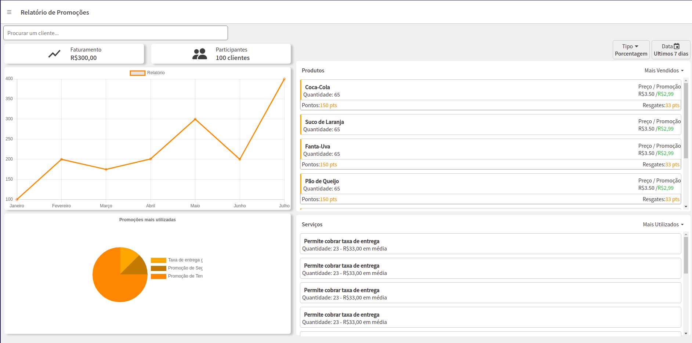

## Captura de tela


## Link para visualização
Projeto hospedado em: https://mytest-eight.vercel.app

## 🖱 Instalação e Execução
<p>
  Para instalar as dependências e executar o servidor no modo de desenvolvimento:
  
  - Clone o projeto no seu computador
    ```
    git clone https://github.com/mlasa/grandchef-test.git
    ```
  
  
  - Acesse a pasta que acabou de ser criada e depois a pasta web
    ```bash
      cd grandchef-test/web
    ```
    
  - Agora que está na pasta web, execute:
      ```bash
      yarn
      yarn start
    ```
    
  - A página vai abrir no seu navegador.
</p>
